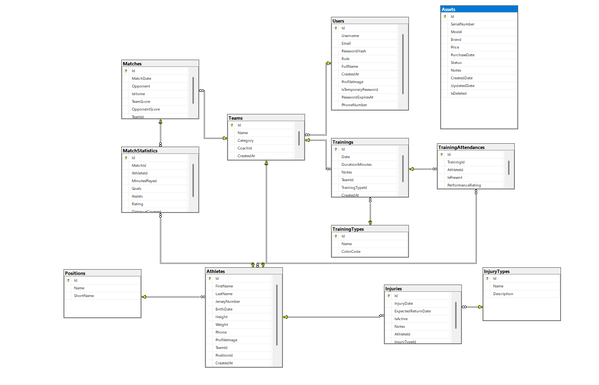
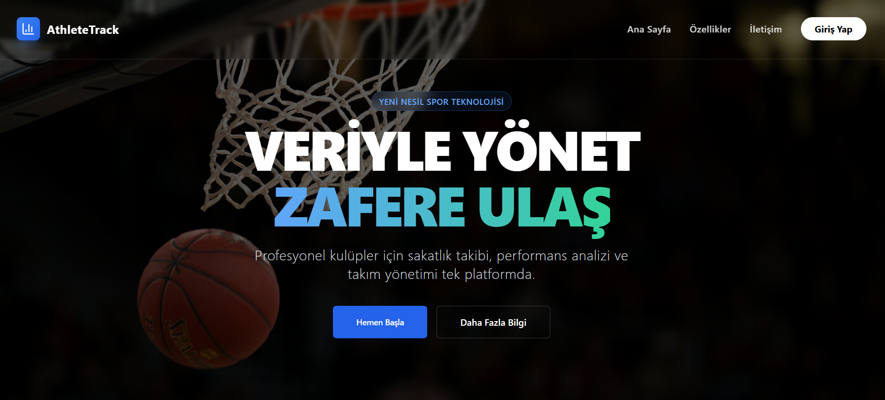
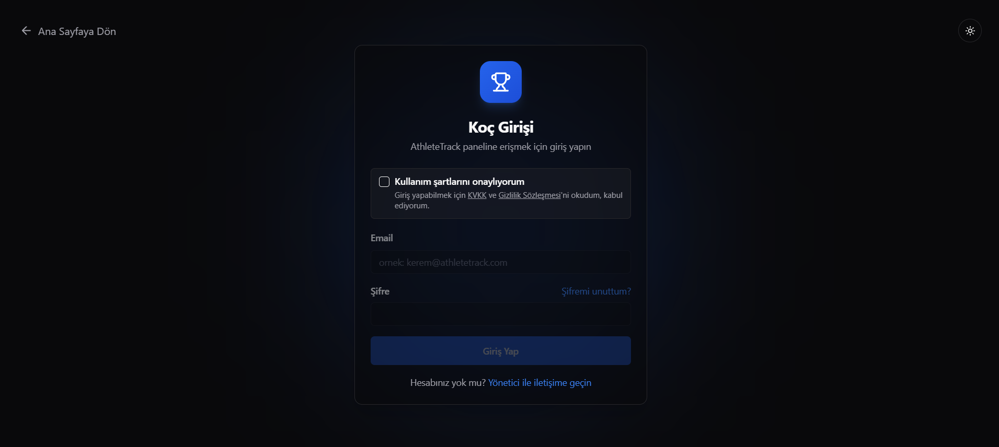
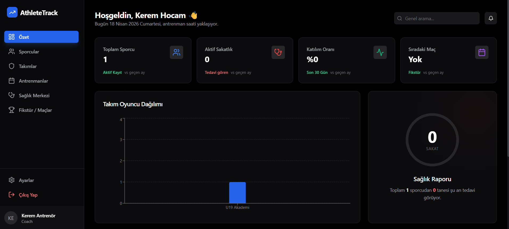
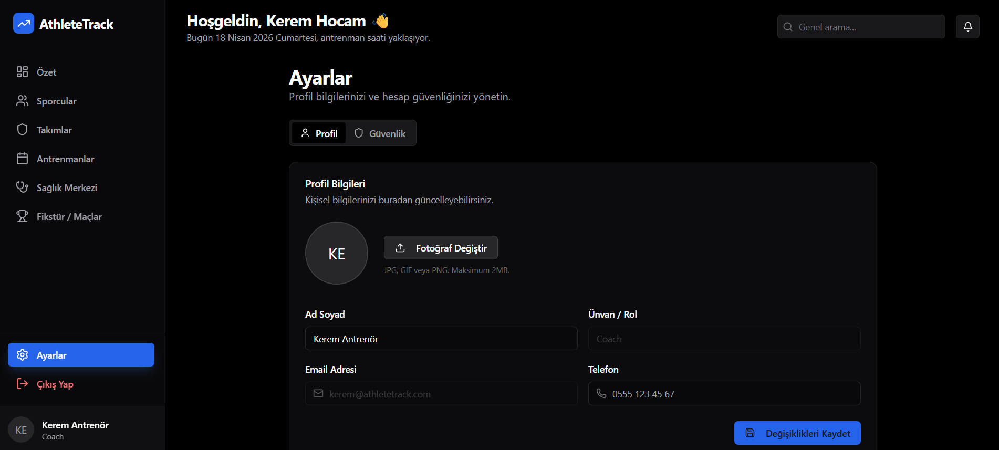

# AthleteTrack - Sporcu Yönetim ve Takip Sistemi

Bu proje, spor kulüpleri ve antrenörler için geliştirilmiş; sporcu, antrenman, sakatlık ve performans takibi sağlayan kapsamlı bir yönetim panelidir.

## 🚀 Kullanılan Teknolojiler

- Frontend: React (Vite), TypeScript, Tailwind CSS, shadcn/ui, Recharts

- Backend: .NET 9 Web API, Entity Framework Core

- Veritabanı: MS SQL Server

## Veritabanı Diyagramı

## Ekran Görüntüleri

## 🛠️ Kurulum ve Çalıştırma

Projeyi bilgisayarınızda çalıştırmak için aşağıdaki adımları izleyin:

### 1. Veritabanı Kurulumu

- SQL Server Management Studio (SSMS) uygulamasını açın.

- API/Scripts/DatabaseBackup.sql dosyasını açın ve çalıştırın (veya Update-Database komutunu kullanın).

- API/appsettings.json dosyasındaki "Server" bilgisinin sizin bilgisayarınızla uyumlu olduğundan emin olun.

### 2. Backend'i Başlatma

- Terminalde API klasörüne gidin: `cd API`

- Komutu çalıştırın: `dotnet watch run`

- Sunucu http://localhost:5028 adresinde çalışacaktır.

### 3. Frontend'i Başlatma

- Yeni bir terminalde Client klasörüne gidin: `cd Client`

- Paketleri yükleyin (ilk kez ise): `npm install`

- Komutu çalıştırın: `npm run dev`

- Tarayıcıda verilen linke (örn: http://localhost:5173) gidin.

🔑 Giriş Bilgileri (Test Hesabı)

- Email: kerem@athletetrack.com

- Şifre: 123456

- (Not: Sistemde hashleme aktiftir, bu şifre veritabanında şifreli tutulmaktadır.)

### 🌟 Öne Çıkan Özellikler

- Rol Bazlı Giriş: Sadece @athletetrack.com uzantılı kurumsal hesaplar girebilir.

- Gelişmiş Dashboard: Anlık veri analizi ve grafiksel raporlar.

- İlişkisel Veritabanı: 11 Tablo ile 3NF normalizasyon kurallarına uygun yapı.

- Güvenlik: Şifreleme (BCrypt), Geçici şifre uyarısı ve Soft Delete mimarisi.
